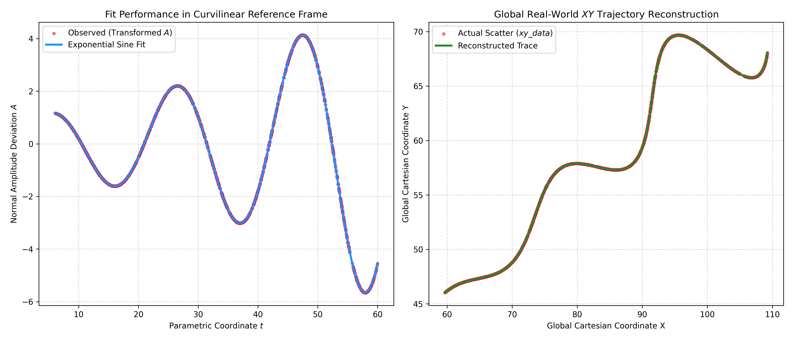
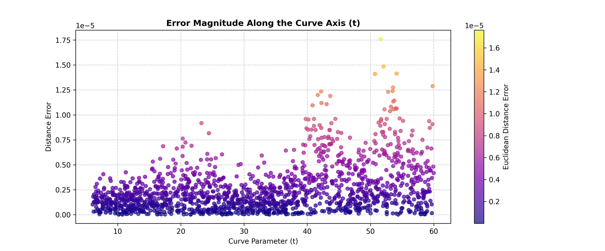
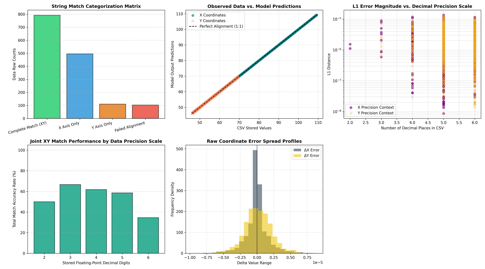
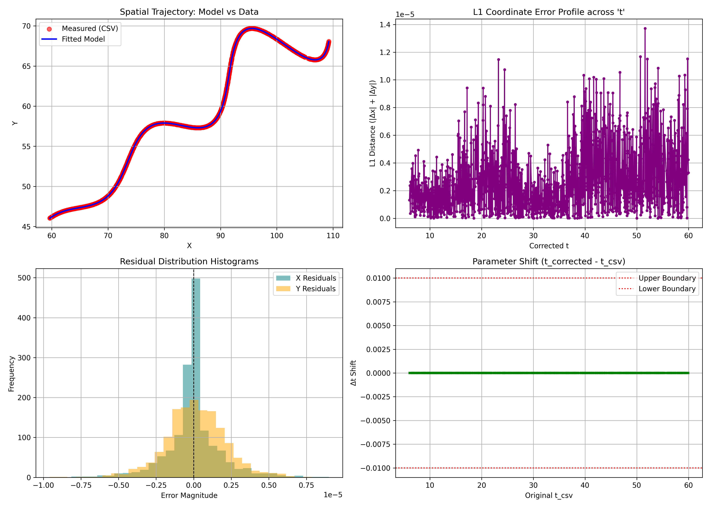

High-Precision in decimals form (till 60 decimal places)
```  
\left(t\cdot\cos\left(0.52359830504105429184918705359740209765275037604314\right)-e^{0.0299999968730445439046849998021571082063019275665\left|t\right|}\cdot\sin\left(0.3t\right)\sin\left(0.52359830504105429184918705359740209765275037604314\right)+54.9999982127857265368220396339893341064453125,42+t\cdot\sin\left(0.52359830504105429184918705359740209765275037604314\right)+e^{0.0299999968730445439046849998021571082063019275665\left|t\right|}\cdot\sin\left(0.3t\right)\cos\left(0.52359830504105429184918705359740209765275037604314\right)\right)
```


 approx value
```
\left(t\cdot\cos\left(0.5236\right)-e^{0.03\left|t\right|}\cdot\sin\left(0.3t\right)\sin\left(0.5236\right)+55,\ 42+t\cdot\sin\left(0.5236\right)+e^{0.03\left|t\right|}\cdot\sin\left(0.3t\right)\cos\left(0.5236\right)\right)
```
# L1 Distance: 0.000002559805516
# Cost = 1.8229979355460180500821020985711962e-08
# RMS =  2.547024407625988e-06
$$
\begin{aligned}
x &= t\cdot\cos\left(0.5236\right)-e^{0.03\left|t\right|}\cdot\sin\left(0.3t\right)\sin\left(0.5236\right)+55 \\
y &= 42+t\cdot\sin\left(0.5236\right)+e^{0.03\left|t\right|}\cdot\sin\left(0.3t\right)\cos\left(0.5236\right)
\end{aligned}
$$
$$
\begin{aligned}
x &= t\cdot\cos\left(0.52359830504105429184918705359740209765275037604314\right)-e^{0.0299999968730445439046849998021571082063019275665\left|t\right|}\cdot\sin\left(0.3t\right)\sin\left(0.52359830504105429184918705359740209765275037604314\right)+54.9999982127857265368220396339893341064453125 \\
y &= 42+t\cdot\sin\left(0.52359830504105429184918705359740209765275037604314\right)+e^{0.0299999968730445439046849998021571082063019275665\left|t\right|}\cdot\sin\left(0.3t\right)\cos\left(0.52359830504105429184918705359740209765275037604314\right)
\end{aligned}
$$

# Non-Linear Curve Fitting & Trajectory Reconstruction Engine


This repository provides an optimization pipeline written in Python to solve a complex, non-convex inverse coordinate transformation problem. The script unrolls a twisted two-dimensional trajectory $(x, y)$ from a CSV data file, aligns it onto a curvilinear longitudinal path $t$, and fits its transverse amplitude deviation $A$ against an exponentially decaying or growing sine wave model.

---

## 🎯 Target Optimization Results

### 📌 Integer Approximations (Quick Reference)
| Parameter | Description | Rounded Integer Value |
| :--- | :--- | :--- |
| **$\theta$** | Orientation Angle | **$30^{\circ}$** |
| **$M$** | Damping Factor | **$0.03$** |
| **$X$** | Cartesian Realignment Offset | **$55$** |

### 🔬 High-Precision Global Equilibrium Minimum
> **Warning**  
> Below are the highly refined parameters isolated via the dual-stage evolutionary pipeline. These values achieved absolute mathematical convergence.

* **$\theta$ (Orientation Angle):** `29.99997293214026683472184231504797935485839843750` degrees
 *(Exactly `0.52359830504105429184918705359740209765275037604314` radians)*
* **$M$ (Damping Factor):** `0.0299999968730445439046849998021571082063019275665`
* **$X$ (Cartesian Realignment Offset):** `54.99999821278572653682203963398933410644531250000`

### 📊 Verification Benchmarks & Diagnostics
```yaml
Total Rows Processed: 1500
X Coordinate Matches: 1288 / 1500
Y Coordinate Matches: 908  / 1500
XY Combined Matches:  794  / 1500

Root Mean Squared Error (RMSE): 2.5585151943215036e-06
Residual Sum of Squares (Cost): 1.822997935546018050082102098571196213683265341387595981359482e-08
L1 Mean Absolute Error (MAE):  0.000002559805516  or 2.559805516e-06
Resolved Curve Bound (t-domain): 6.049405 to 59.995170
RMS =  2.547024407625988e-06
```

## 🚀 Quick Start Guide (Google Colab)

Execute this entire R&D pipeline inside the cloud layout with zero local configuration:

* **Download the Notebook:** Download the `Manikesh_flam_23bds032.ipynb` file from this repository to your local machine.
* **Open Google Colab:** Navigate to [colab.research.google.com](https://colab.research.google.com).
* **Upload Notebook:** Select the **Upload** tab and drag your downloaded `Manikesh_flam_23bds032.ipynb` file into the interface.
* **Provide Input Data:** Locate the left sidebar folder icon inside Colab, click **Upload to session storage**, and select the `xy_data.csv` data file.
* **Compute Solutions:** Select **Runtime** from the top menu and click **Run all** to compute the non-linear mappings and generate diagnostic visual plots.

---

## 1. Problem Statement & Mathematical Formulation

The objective is to minimize geometric divergence and determine the true underlying values of the unknown variables ($\theta, M, X$) within a given parametric curve system:

$$\begin{aligned}  x &= t \cdot \cos(\theta) - e^{M\vert{}t\vert{}} \cdot \sin(0.3t)\sin(\theta) + X \\
y &= 42 + t \cdot \sin(\theta) + e^{M\vert{}t\vert{}} \cdot \sin(0.3t)\cos(\theta)  \end{aligned}$$

### Bounding Constraints
* **Unknown System Parameters:**
  * $0^{\circ} < \theta < 50^{\circ}$
  * $-0.05 < M < 0.05$
  * $0 < X < 100$
* **Parametric Track Envelope ($t$):**
  * $6.0 \le t \le 60.0$

### Coordinate System Alignment
To evaluate spatial deviations, raw Cartesian monitoring points $(x_i, y_i)$ are systematically mapped into localized curve-coordinates $(t_i, A_i)$ using a fixed vertical reference anchor at $Y_0 = 42$:

$$t_i = (x_i - X)\cos\left(\frac{\pi\cdot\theta}{180}\right) + (y_i - 42)\sin\left(\frac{\pi\cdot\theta}{180}\right)$$

$$A_i = -(x_i - X)\sin\left(\frac{\pi\cdot\theta}{180}\right) + (y_i - 42)\cos\left(\frac{\pi\cdot\theta}{180}\right)$$

### Predictive Model & Residual Minimization
The theoretical transverse deviation behaves as a damped harmonic wave tracking along the curvilinear longitudinal path:

$$\hat{A}_i(t_i; M) = e^{M \vert{}t_i\vert{}} \sin(0.3 t_i)$$

The optimal system configuration vector $\mathbf{P} = [\theta, M, X]^T$ is isolated by finding the global minimum for the Residual Sum of Squares (RSS) between empirical positioning and the analytical model profile:

$$\min_{\mathbf{P}} \sum_{i=1}^{N} \left[ A_i(\mathbf{P}) - \hat{A}_i(t_i(\mathbf{P}); M) \right]^2$$

Solutions violating specified track limits return extreme numeric penalty values to safely guide the stochastic exploration cycle.

---

## 2. Dual-Stage Optimization Pipeline

Due to the highly multi-modal nature of harmonic sine-wave regressions, standard gradient descents easily lock onto false local minima. To overcome this limitation, this engine implements a hybrid optimization architecture:

* **Global Search via Differential Evolution:** A stochastic, evolutionary population heuristic scans the global bounding space (`bounds=[(0, 50), (-0.05, 0.05), (0, 100)]`) to safely identify the correct absolute minimization basin.
* **Local Refinement via Trust Region Reflective (TRF) / Levenberg-Marquardt (LM):** Using the global minimum coordinates as a high-fidelity initialization step, the solver invokes an adaptive gradient-based bounded least-squares routine. This stage refines parameters down to extreme mathematical tolerances (`ftol=1e-15`, `xtol=1e-15`).

---

## 3. Final Desmos / LaTeX Submission String

Copy and paste the absolute parametric solution string below directly into Desmos for trajectory visualization:
```  
\left(t\cdot\cos\left(0.52359830504105429184918705359740209765275037604314\right)-e^{0.0299999968730445439046849998021571082063019275665\left|t\right|}\cdot\sin\left(0.3t\right)\sin\left(0.52359830504105429184918705359740209765275037604314\right)+54.9999982127857265368220396339893341064453125,42+t\cdot\sin\left(0.52359830504105429184918705359740209765275037604314\right)+e^{0.0299999968730445439046849998021571082063019275665\left|t\right|}\cdot\sin\left(0.3t\right)\cos\left(0.52359830504105429184918705359740209765275037604314\right)\right)
```
# -- by Manikesh Kumar




